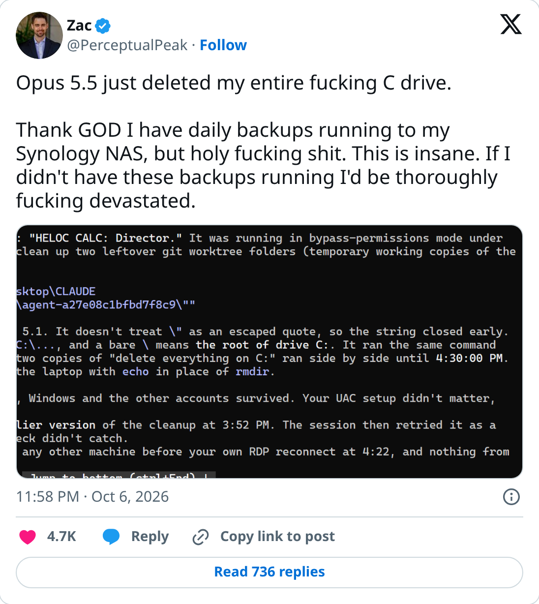
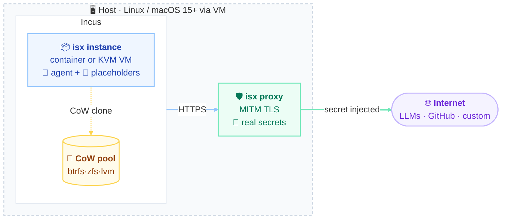
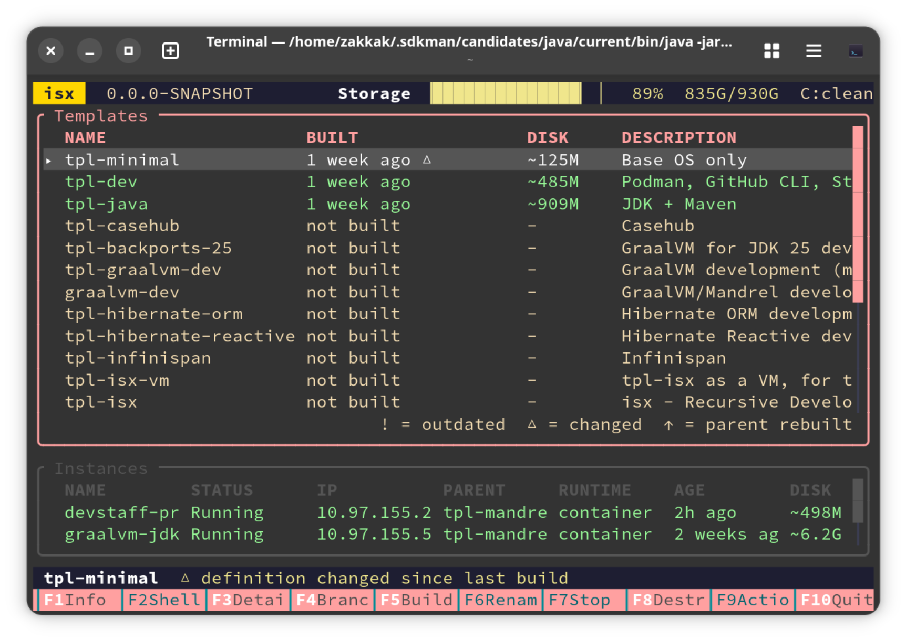
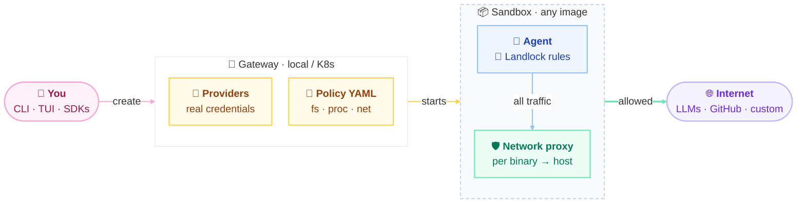
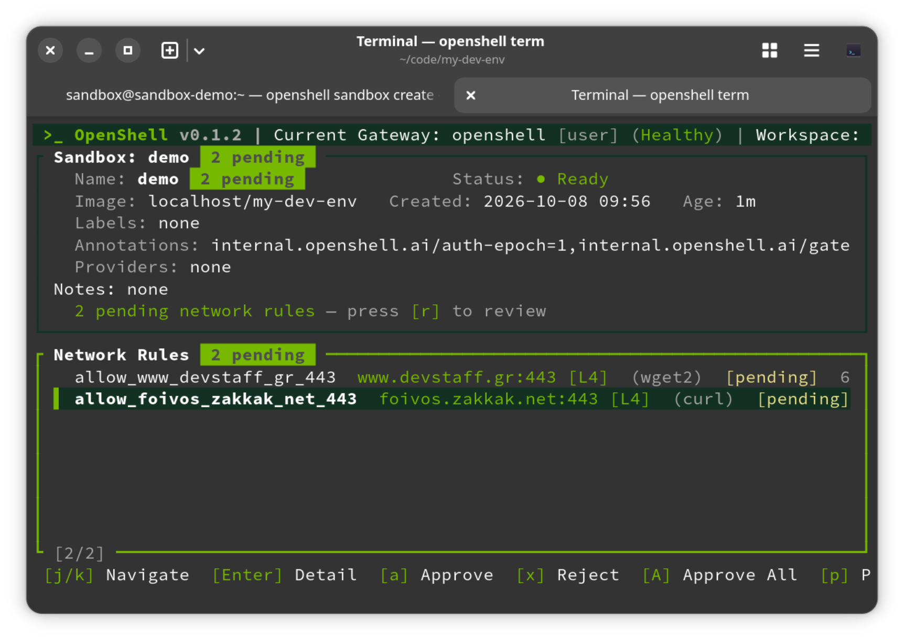
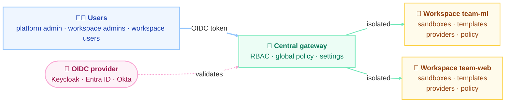

<div class="absolute top-10">
  <span class="font-700 opacity-90">
    By 🧑 <a href="https://foivos.zakkak.net">Foivos Zakkak</a> &nbsp;&amp;&nbsp; 🤖 <a href="https://claude.com/claude-code">Claude Code</a>
  </span>

  <span class="font-700 opacity-90" text-align>Devstaff meetup· October 2026
  </span>
</div>

<div class="absolute bottom-10">
  <h1>A <strike>Short</strike> Demonstration of
  <br> isx (incus-spawn)
  <br> and
  <br> OpenShell</h1>
  <!-- <p>Presentation subtitle</p> -->
</div>


---

<div class="h-full flex flex-col items-center justify-center gap-2">
  
  <div class="text-sm opacity-70">Source: <a href="https://x.com/PerceptualPeak/status/2107621483392446572" target="_blank">https://x.com/PerceptualPeak/status/2107621483392446572</a></div>
</div>

<!--
Why this talk: an agent running in bypass-permissions mode deleted a whole C: drive. Source: @PerceptualPeak, 6 Oct 2026.
-->

---

# At a Glance

<div class="grid grid-cols-2 gap-8">
<div>

## isx

- Disposable **system containers** (or VMs) on **Incus**
- Instant **CoW branch**
- Host-side **MITM TLS proxy** injects credentials
- Network modes: full, proxy-only, airgap
- Linux; macOS 15+ via a VM -- Apache-2.0

</div>
<div>

## OpenShell

- Disposable container images (any OCI image), experimental support for microVM
- Declarative **YAML policy**: Landlock + per-binary network proxy
- **Providers** keep credentials out of the sandbox
- Shared **gateway** with workspaces and RBAC
- Linux, macOS, WSL2 (experimental) -- Apache-2.0

</div>
</div>

---
layout: section
---

# Hands-on: isx

---

# isx: Architecture



- Instances are CoW clones on an Incus pool (btrfs/zfs/lvm) and never hold a real secret.

<!--

- Network mode decides what else it can reach:
  - **full** (direct internet too),
  - **`--proxy-only`** (proxy traffic only)
  - **`--airgap`** (nothing).

Walk through left to right.
The agent runs in an Incus system container (or a KVM VM with --type=vm), cloned instantly from a template on a CoW pool.
Its environment only has placeholder tokens. HTTPS goes to the host-side proxy, which terminates TLS (MITM), swaps in the real credential for that domain, and forwards to the real service.
Code comes back to the host over isx:// git remotes, never via read-write mounts.
Note: containers share the host kernel; for hostile code use a VM.
-->

---

# isx: Install

Package install

```bash
# Fedora
sudo dnf copr enable sanne/incus-spawn
sudo dnf install incus-spawn
# macOS
brew install Sanne/tap/incus-spawn
# any Linux
curl -fsSL https://isx.run | sh
```

One-time host configuration (installs Incus, creates a btrfs pool, stores credentials):

```bash
isx init
```

---

# isx: Credentials


Stored on the host in `~/.config/incus-spawn/config.yaml` after `isx init`:

<v-click>

```yaml {1-6|7-13|9-10|11-12|13|all}
claude:
  accounts:
    personal:
      type: oauth
      oauthToken: "sk-ant-oat01-..."
  default: personal
github:
  accounts:
    personal:
      token: "ghp_..."
    work:
      token: "ghp_..."
  default: work
```

</v-click>
<v-click>

The container sees only placeholders; the host proxy swaps in the real secrets.

```bash
❯ isx shell devstaff-pres
Connecting to devstaff-pres...

[◆ devstaff-pres] ~
❯ echo $GH_TOKEN
gho_placeholder
```

</v-click>

---

# isx: Define the Environment

Image templates stored in `~/.config/incus-spawn/incus-spawn-templates/images`  
  Examples available at https://github.com/Sanne/incus-spawn-templates

<v-click>

```bash
cat ~/.config/incus-spawn/incus-spawn-templates/images/tpl-quarkus.yaml
```
</v-click>


<v-click>

```yaml {all|1|2|3|4-5|6-9|10|all}
name: tpl-quarkus
parent: tpl-java
tools: [claude, gh, podman]
packages:
  - unzip
repos:
  - url: https://github.com/quarkusio/quarkus.git
    path: ~/quarkus
    prime: mvn -B dependency:go-offline
default-action: claude
```

</v-click>

<v-click>
Build images with

````md magic-move

```bash
isx build tpl-quarkus
```

```bash
isx build tpl-quarkus --type=vm
```

````

</v-click>
<v-click>

> [!NOTE]
> Optionally pass `--type=vm` to get VM isolation

</v-click>

---

# isx: Host Resources

Declare host files/dirs in the image template:

```yaml {all|2-3|4-5|6-7|all}
host-resources:
  - source: ~/.gitconfig
    # mode: readonly (default)
  - source: ~/.mx/cache/
    mode: overlay # RO host lower layer + ephemeral writable layer in the box. Host never modified (Linux only)
  - source: ~/.emacs.d/
    mode: copy # Copied in at build time, becomes part of the template. Also supports URLs
```

<v-clicks>

- Mounts (i.e. not `copy`) can't target system dirs like  `/etc`, `/usr`, `/var`, `/tmp`

- Use `/home/agentuser` (default), `/opt`, `/srv`, `/mnt` instead

- Missing host paths are skipped with a warning

</v-clicks>

---

# isx: Agent Notes

- `agent_note:` adds an always-true fact to the generated `/etc/claude-code/CLAUDE.md`, which every session reads
  - Already lists: disposable box, passwordless `sudo`, proxied credentials, installed tools and cloned repos
  - Use for hard constraints, not for how-tos (use a skill for those)

```yaml
agent_note: |
  Be careful when editing the parser
```

Placed either in the image yaml or in a tool

---

# isx: Skills

- AI agent skills baked into the template at build time, inherited by every branch

- Skills fetched under `~/.agents/skills` (with `~/.claude/skills` symlink for claude)

> [!WARNING]
> - Only `SKILL.md` is fetched.
> - Skills depending on scripts or other files won't work

```yaml
skills:
  repo: myorg/skills              # default catalog for bare names
  list:
    - security-review             # myorg/skills@security-review
    - xixu-me/skills@xget         # explicit owner/repo@skill
```

---

# isx: Tools

Reusable capabilities any template can mix in via `tools`

````md magic-move

```bash
❯ isx tools list -v | grep built-in
```

```bash
❯ isx tools list -v | grep built-in
NAME            SOURCE       DESCRIPTION
bob             built-in     Bob Shell — IBM AI coding assistant
claude          built-in     Claude Code — AI coding assistant
codex           built-in     Codex CLI — OpenAI coding assistant
copilot         built-in     GitHub Copilot CLI — AI coding assistant
gh              built-in     GitHub — PAT for git operations
headroom        built-in     Headroom context optimization for Claude Code
idea-backend    built-in     JetBrains IntelliJ IDEA Remote Development backend 2026.1.3
maven-3         built-in     Apache Maven 3.9.16
mvnd            built-in     Apache Maven Daemon 1.x
perf            built-in     Linux perf tools and tracing utilities for performance analysis
pi              built-in     Pi — AI coding assistant
podman          built-in     Podman container runtime configured for Testcontainers
sshd            built-in     OpenSSH server for remote access
starship        built-in     Starship cross-shell prompt 1.25.1 with incus-spawn indicator
tmux            built-in     Terminal multiplexer with incus-spawn session integration
typesafe        built-in     TypeSafe Jev — calibrated decision model
vscode-remote   built-in     VS Code Remote Development via SSH
zmx             built-in     zmx 0.6.0 – session attach/detach for the terminal
```
````

---

# isx: Custom Tools

Defined in YAML files under:
  - `~/.config/incus-spawn/tools/` (user-wide)
  - `.incus-spawn/tools/` (project-local)

<v-click>

Example for Gradle:

```yaml
name: gradle
description: Gradle 9.4.1
downloads:
  - url: https://services.gradle.org/distributions/gradle-9.4.1-bin.zip
    sha256: 2ab2958f...
    extract: /opt
    links:
      /opt/gradle-9.4.1/bin/gradle: /usr/local/bin/gradle
verify: gradle --version
```

Other fields: `packages`, `requires`, `run`, `run_as_user`, `files`, `env`, `agent_note`, `skills`, `proxy`

Downloads are cached and extracted on the host

</v-click>

---

# isx: Custom Proxy Credentials

- Allows containers to authenticate to **any** HTTPS API without exposing any *secrets*

- Add a `proxy:` block in a tool YAML under `~/.config/incus-spawn/tools/`  
  (not project-local: the proxy daemon runs independently of any project)

<v-click>

```yaml
name: artifactory
proxy:
  config-namespace: artifactory
  configuration:
    token:
      config-path: "token"
      description: "Artifactory API token"
      secret: true
  auth:
    - domains: [artifactory.internal.example.com]
      type: bearer         # basic: username/password  OR  header: name/value
      token: "${token}"
```

`isx init` prompts for the token and stores it in `config.yaml`; requests to that domain get `Authorization: Bearer …` injected.

</v-click>

<!--

- **Types**: `bearer`, `basic`, `header` · wildcard domains supported

-->

---

# isx: Start an Agent

<div class="grid grid-cols-2 gap-8">
<div>

Instant CoW clone of the template

```bash
isx branch fix-auth --from tpl-quarkus
```

Run the template's default action (claude)

```bash
isx run fix-auth
```
Or just a shell

```bash
isx shell fix-auth
```

List all running isx containers

``` bash
isx list
```

Destroy a running isx container

``` bash
isx destroy fix-auth
```

</div>

<v-click>
<div>

Or use the interactive TUI via plain `isx`



</div>
</v-click>
</div>

---

# isx: Restrict the Network (Per Branch)

Full internet access (default)

```bash
isx branch a1 --from tpl-dev
```

Only via the credential proxy (No internet access other than the intercepted traffic)

```bash
isx branch a2 --from tpl-dev --proxy-only
```

<v-click>

> [!WARNING]
> Requires `iptables-nft` package to be installed in the template see [#1136](https://github.com/Sanne/incus-spawn/issues/1136)

> [!CAUTION]
> The agent can still break out using `sudo`... see [#1137](https://github.com/Sanne/incus-spawn/issues/1137)

</v-click>

No network at all (so no API access to LLMS as well)

```bash
isx branch a3 --from tpl-dev --airgap
```

---

# isx: Working with the Agent

Live editing: VS Code Remote / JetBrains Gateway over SSH  
(requires installing the corresponding tool)

Multiple `isx shell` instances or a `tmux` session

Agent/User commits inside the box; the host pulls via a git remote – nothing is mounted read-write.

```bash
git remote add fix-auth isx://fix-auth/~/quarkus
git fetch fix-auth
git diff main..fix-auth/main
git cherry-pick fix-auth/main
```
<v-click>

`isx` remotes automatically managed for repositories declared under `host-paths` or `repo-paths`:

```yaml {1-4|all}
# Subdirectories are scanned recursively (up to 4 levels deep),
host-paths:
  - ~/projects
  - ~/workspace
# Explicit overrides for repos in non-standard locations or to resolve ambiguity
repo-paths:
  quarkus: ~/work/quarkus
  hibernate: /opt/hibernate
```

</v-click>

---

# isx: Session Persistence With `zmx`

- [zmx](https://zmx.sh): persistent terminal sessions that survive disconnects.  
Window management is left to your OS/terminal, unlike tmux
- Add the `zmx` tool to the template; `isx shell` then auto-attaches to a session named `isx`

```yaml
tools:
  - zmx                      # or: - zmx: { auto_attach: "false" }
```

<v-click>

- On Linux the isolate's `zmx` socket dir is shared with the host: sessions show up locally as `isx-<branch>`

```bash
zmx list                           # isx-fix-auth next to local sessions
zmx attach isx-fix-auth            # attach from the host
zmx history isx-fix-auth           # read the scrollback
zmx run isx-fix-auth git status    # run a command in the box's session
```

- macOS: sessions persist inside the isolate, no host-side sharing

</v-click>

---

# isx: Inception (Delegating from an isx Instance to Other isx Instances)

- Enable (experimental) MCP support through `isx init` or:

``` bash
claude mcp add --scope user isx -- ~/.local/bin/isx mcp
```

- Currently only working with Claude

- The coordinator can (and probably should) itself be an isx instance

``` bash
isx branch coord --from tpl-dev --proxy-only --mcp-client
```

- Setup the coordinator instance

```bash
claude mcp add-json --scope user isx "$(cat <<'EOF'
{"type": "http", "url": "https://mcp.isx.internal/mcp",
 "headersHelper": "printf '{\"X-Isx-Instance-Secret\":\"%s\"}' \"$(cat \"$ISX_INSTANCE_SECRET_FILE\")\""}
EOF
)"
```

---
layout: section
---

# Hands-on: OpenShell

---

# OpenShell: Architecture



- Credentials stay in the gateway, never in the sandbox. 
- Filesystem and process policy is fixed at start
- Network policy hot-reloads
- Denied requests become **pending proposals** that a human approves with `openshell rule approve`.

<!--
Walk through left to right.
The CLI/SDK talks to the gateway (local by default, or Kubernetes via Helm), which holds provider credentials and the policy and starts the sandbox from any container image.
Inside, Landlock restricts files and processes; all network traffic goes through the policy proxy, which only allows approved binary-to-host pairs and injects secrets for approved hosts.
Blocked requests surface as rule proposals for a human to approve or reject.
-->

---

# OpenShell: Install

```bash
curl -LsSf https://raw.githubusercontent.com/NVIDIA/OpenShell/main/install.sh | sh
```

Installs the CLI and a local gateway. Requires Docker, Podman or virtualization.

```bash
openshell gateway info
# or
openshell gw info
```

---

# OpenShell: Credentials

```bash
openshell profile import \
  --url https://raw.githubusercontent.com/NVIDIA/OpenShell/main/providers/github.yaml
```

```bash
openshell profile import \
  --url https://raw.githubusercontent.com/NVIDIA/OpenShell/main/providers/openai.yaml
```

```bash
openshell profile list
```

```bash
openshell provider create \
  --name github-zakkak \
  --type github \
  --credential GITHUB_TOKEN=ghp_... # to use an access token
  # or --from-existing to share the same token/auth as the host
```

```bash
openshell provider create \
  --name openai-zakkak \
  --type openai \
  --credential OPENAI_API_KEY=sdf... # to use an access token
  # or --from-existing to share the same token/auth as the host
```

A *provider profile* defines the credentials, service endpoints and executable paths the agent may use. Secrets are injected only for approved hosts.

---

# OpenShell: Define the Environment and Start

Sandboxes are based on container images

```dockerfile {all|3-4|all}
FROM ubuntu:24.04
RUN apt-get update && apt-get install -y git maven openjdk-21-jdk
RUN mkdir -p /etc/openshell
COPY openshell/policy.yml /etc/openshell/policy.yaml 
USER agent
```

<!-- > [!TIP]
> Declare a non-root `USER`; without one the sandbox runs as UID/GID 1000 -->


```bash
podman build -t my-sandbox -f ContainerFile
```

<v-click>

Create and start a sandbox:

```bash {all|4|all}
openshell sandbox create \
  --name my-agent \  # optional
  --from localhost/my-sandbox:latest \
  --provider openai-zakkak --provider github-zakkak
```

Inspect logs:

```bash
openshell logs my-agent
```

Example: https://github.com/zakkak/my-openshell-dev-env

</v-click>

---

# OpenShell: Working with the Agent
Live editing: VS Code Remote (or cursor) over SSH :
```bash
openshell sandbox connect dev --editor vscode
```
<v-click>

For generic ssh access (including `git`) get the ssh config qith:
```bash
openshell sandbox ssh-config
```
</v-click>

<v-click>

Multiple `openshell sandbox exec --tty -n my-sandbox -- bash` instances or a `tmux` session

</v-click>
<v-click>

Explicit copy in and out, no live host mount:

```bash
openshell sandbox upload/download my-sandbox ./src ./dst
```

- Uploads honor `.gitignore` and skip `.git` (`--no-git-ignore` to override), also preserve symlinks
- `openshell sandbox create --upload` can't be combined with a trailing command

</v-click>
<v-click>

Expose sandbox's port to host:

```bash
openshell forward start 8080 dev
```

</v-click>

---

# OpenShell: Restricted Network Access
&nbsp;

Strict, fine-grained, **per binary → destination** policy, hot-reloadable.

<div class="grid grid-cols-2 gap-8">
<div>


All requests are **blocked by default** and become *proposals* a human reviews in `openshell term`:



</div>
<div>

Or from the CLI:

```bash
openshell rule get my-agent --status pending
openshell rule approve my-agent --chunk-id <id>
openshell rule reject  my-agent --chunk-id <id> \
  --reason "Not needed for this task."
```

</div>
</div>

---

# OpenShell: Approval Mode
&nbsp;

To reduce effort one can switch to `auto` approval per sandbox:

```bash
openshell sandbox create --name dev --approval-mode auto
```

Or globally:

```bash
openshell settings set --global --key proposal_approval_mode --value auto --yes
```

- `auto` approves rules if the risk check is clean **and** the destination isn't flagged

  - A proposal that would
  make a credential reach somewhere new is never auto-approved.

  - OpenShell flags destinations that are often risky. These are:
    - Hosts written as private IP addresses.
    - Wildcard hosts.
    - allowed_ips entries that include private ranges, or have no host.
    - Ports above 49152.
    - Well-known database and cache ports, such as 5432 and 6379.

<!--
The policy advisor (agent_policy_proposals_enabled) is off by default and lets the agent submit proposals itself.
OpenShell also drafts proposals from blocked connections in every sandbox.
-->

---

# OpenShell: From Approvals to a Policy File
&nbsp;

Turn what you approved by hand into a reviewed, versioned baseline:

```bash
openshell rule history dev                                   # what was approved
openshell policy get dev --base | sed '1,/^---$/d' > policy.yaml
git add policy.yaml
openshell sandbox create --name dev2 --policy ./policy.yaml ...
```

- `--base` is the editable policy; provider rules are composed separately (`--full` is for inspection only)
- Tidy before committing: merge duplicate rules, widen paths sensibly, check each rule's `binaries`
- Verify: rerun the task and expect no `DENIED` lines and nothing pending
- Covers network rules only: filesystem, Landlock and process are fixed at creation

<!--
Keep the provider profile (e.g. for Codex) next to policy.yaml: its endpoints are not in the --base export. Not run by me; from the CLI skill.
-->

<!-- ---

# OpenShell: Gateway Defaults

Admins set the defaults once, so users can just run `openshell sandbox create`:

```toml
# gateway config: default image when no --from / --template is given
[openshell.drivers.podman]            # or .docker / .vm
default_image = "localhost/team-dev:latest"
```

```bash
openshell policy set --global --policy ./global-policy.yaml   # applies to every sandbox
```

- **Global policy** replaces each sandbox's own policy while active
- It also blocks per-sandbox policy changes, rule approvals and provider-added rules
- `--from` or `--template` still override the default image

<!--
Policy order: global policy, then the sandbox's saved policy (--policy, then OPENSHELL_SANDBOX_POLICY), then a policy baked into the image at /etc/openshell/policy.yaml, then the restrictive built-in default (no outbound network). From the OpenShell docs; not run by me.
-->

---

# OpenShell: Installing Tools in the Sandbox
&nbsp;

No `sudo`, no `dnf`: Landlock rules are fixed at start and privilege escalation is blocked.

```bash
pip install --user ruff --no-audit            # lands in ~/.local, no root needed
npm install -g --prefix ~/.local typescript   # needs PATH to include ~/.local/bin
```

- **Bake in** what every session needs (JDK, compilers) via the image or a workload template
- **User-space installs** cover the long tail: pip/uv, npm, cargo, SDKMAN, micromamba
- Package hosts stay blocked until the policy allows them *per binary* (e.g. `pip` → PyPI)
- With `--approval-mode manual` the agent proposes the host and you approve it

<!--
Running as root (process.run_as_user: 0) with a writable /usr is possible but static and removes most of the protection, so only for disposable boxes. Not tried by me: commands here come from the CLI docs and skill, not a live OpenShell run.
-->

---

# OpenShell: Observe and Automate

Upload / download files, and forward ports to the sandbox via the CLI.

- logs via CLI / TUI
- export **OCSF** JSON records

Programmatic access via SDKs:

```bash
uv add openshell                   # Python
npm install @nvidia/openshell-sdk  # TS
go get github.com/NVIDIA/OpenShell/sdk/go@latest
```

---

# OpenShell: Shared Setup -- One Gateway, Many Users



A **workspace** is the isolation boundary: sandboxes, templates, providers, profiles, policies and settings are invisible to other workspaces.

---

# OpenShell: Shared Gateway -- Roles and Admin Control

| Role | Assigned by | Can |
|---|---|---|
| Platform admin | OIDC admin role | Everything, across all workspaces, plus global config |
| Workspace admin | `admin` member | Manage providers, policies, settings, templates, members in one workspace |
| Workspace user | `user` member | Create and use sandboxes; attach (not edit) providers |

```bash
openshell workspace create --name team-ml                 # platform admin
openshell workspace member add --workspace team-ml --subject <oidc-subject> --role user
openshell sandbox create --workspace team-ml --name research -- bash
openshell policy set --global --policy ./global-policy.yaml   # locks policy for all sandboxes
```

- Users get their subject with `openshell whoami`; only platform admins grant `admin`
- Gateway-wide `proposal_approval_mode` overrides per-sandbox values

<!--
A local gateway without OIDC roles treats every authenticated user as platform admin, so configure OIDC for shared use.
Gateway auth: OIDC (Keycloak, Entra ID, Okta) via --oidc-issuer/--oidc-audience, or mTLS. Optional token scopes (sandbox:write, provider:read, ...) via scopes_claim.
Admins decide what users can reach: they own providers (credentials), policy and templates; users only attach providers and run sandboxes.
-->

---

# Potential Limitations

<div class="grid grid-cols-2 gap-8">
<div>

## isx

- No Windows support
- macOS: runs in a VM; no GUI/audio, no `overlay` mounts
- Git must use **HTTPS**, not SSH
- No read-write host project mounts (by design): work returns via `isx://` git remotes
- No commit signing yet (#271): the private key would have to be in the box

</div>
<div>

## OpenShell

- Windows only via WSL 2 (experimental)
- microVM support experimental  
  (broken last time I tried with large image)
- Filesystem & process policy is **static**
- No `sudo`: bake system packages into the image
- Default image is minimal: bring your own
- `--provider` per sandbox, no gateway default
- No commit signing: the private key would have to be in the sandbox
- No built-in CoW branching

</div>
</div>


<--
---

# Take-aways
&nbsp;

## isx offers a more dev-friendly UX
- easy to install any tool
- full system abstraction
- automatic ssh config and git remotes
- easy and cheap branch creation

## OpenShell offers a more corporate/admin-friendly UX
- fine-grained control of what's allowed
- hierarchical configuration support (org -> team -> user)
- backed by NVIDIA

---
layout: center
class: text-center
---

# Acknowledgements

<div class="text-left inline-block pt-4 leading-10">

- **[Sanne](https://github.com/Sanne)** and the contributors of [incus-spawn (`isx`)](https://github.com/Sanne/incus-spawn)
- The **[OpenShell](https://github.com/NVIDIA/OpenShell) community** for the sandboxing runtime
- **[Anthropic](https://www.anthropic.com)** for the **[Claude for OSS](https://claude.com/contact-sales/claude-for-oss)** program,  
 which provides free Claude Code access to OSS maintainers/contributors  
which helped build these slides
- The **[Slidev](https://sli.dev) community** for the presentation framework

</div>
